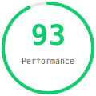

# ISH.SYS

A minimal, brutalist portfolio/blog built with [Hugo](https://gohugo.io/). Live at [proishan11.github.io](https://proishan11.github.io/).

## Lighthouse PageSpeed Insights

<p align="center">
  
  
  
  
</p>

<p align="center">� 0–49 &nbsp;&nbsp; 🟠 50–89 &nbsp;&nbsp; 🟢 90–100</p>

Run the test yourself: [Google Lighthouse PageSpeed Insights](https://pagespeed.web.dev/analysis/https-proishan11-github-io/)

*Last tested: May 27, 2026*

## Features

- **Minimal monospace design** — warm cream palette with JetBrains Mono
- **Light / Dark** theme toggle with cycle button
- **Markdown** with full support for code blocks, math (KaTeX), tables, images
- **Syntax highlighting** via Hugo's built-in Chroma with language badges and copy button
- **Math rendering** via KaTeX (enable per-post with `math: true`)
- **Sidenotes** — margin notes for asides, fun facts, images (shortcode)
- **Reading progress bar** and back-to-top button
- **Scroll reveal** animations and accent-on-scroll effects
- **Table of Contents** — auto-generated for long posts
- **RSS feed**, Open Graph / Twitter meta tags, sitemap
- **Responsive** layout with mobile-first design
- **GitHub Pages** deployment via Actions

## Sections

- **About** — bio, interests, social links (obfuscated email)
- **Posts** — blog with code, math, sidenotes support
- **Projects** — showcase with tech tags, status badges, links
- **Bookshelf** — simple reading list
- **Reading** — curated blogs and resources
- **Resume** — direct PDF download

## Quick Start

### Prerequisites

Install Hugo extended edition: https://gohugo.io/installation/

### Local Development

```bash
hugo server -D
```

### Create a New Post

```bash
hugo new posts/my-new-post.md
```

### Configuration

Edit `hugo.toml` to set your site title, tagline, and base URL:

```toml
baseURL = 'https://YOUR-USERNAME.github.io/'
title = 'YOUR.SITE'

[params]
  tagline = "YOUR TAGLINE HERE"
```

## Deploy to GitHub Pages

1. Push this repo to GitHub
2. Go to **Settings → Pages → Source** and select **GitHub Actions**
3. The included `.github/workflows/hugo.yml` will build and deploy on every push to `main`

## Writing Posts

Posts live in `content/posts/`. Frontmatter options:

```yaml
---
title: "Post Title"
subtitle: "Optional subtitle"
date: 2025-01-01
author: "Your Name"
math: false    # set to true to enable KaTeX
draft: false
---
```

### Math Support

Enable `math: true` in frontmatter, then use:

- Inline: `$E = mc^2$`
- Display: `$$\int_0^\infty e^{-x^2} dx = \frac{\sqrt{\pi}}{2}$$`
